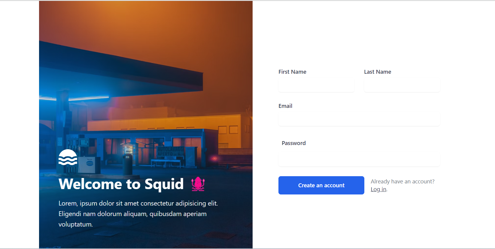
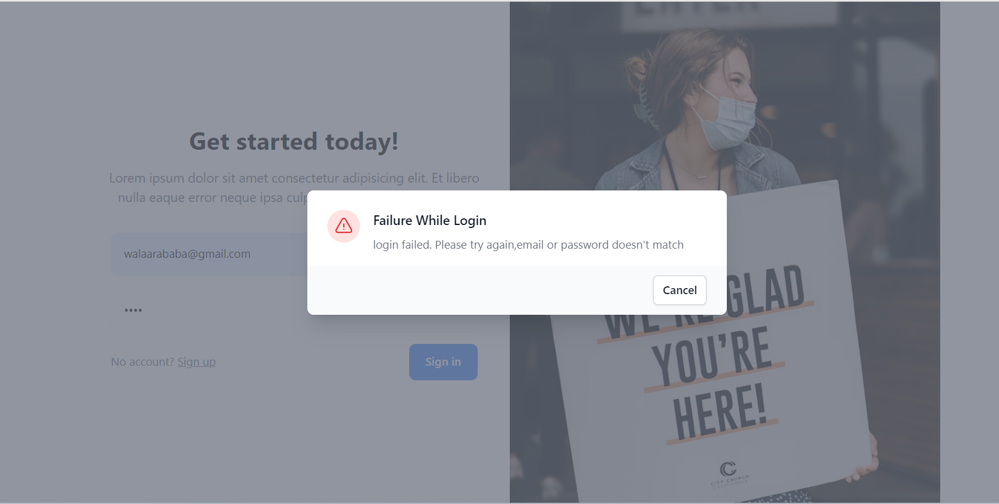
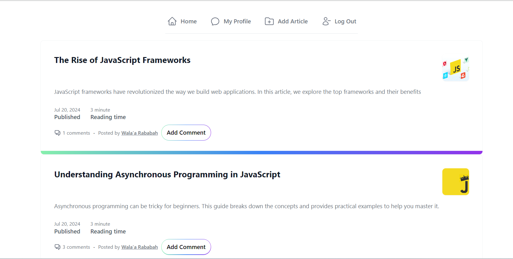
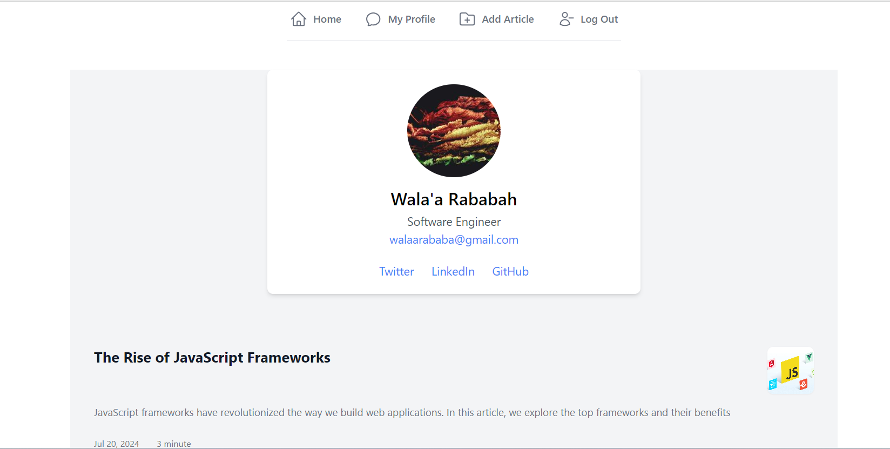
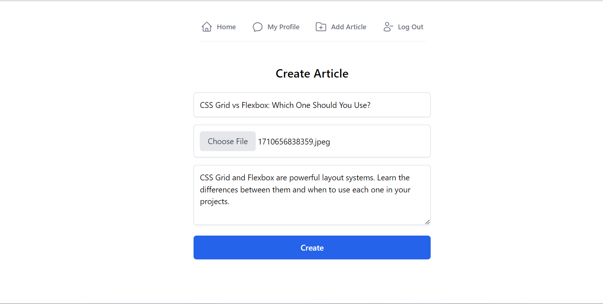
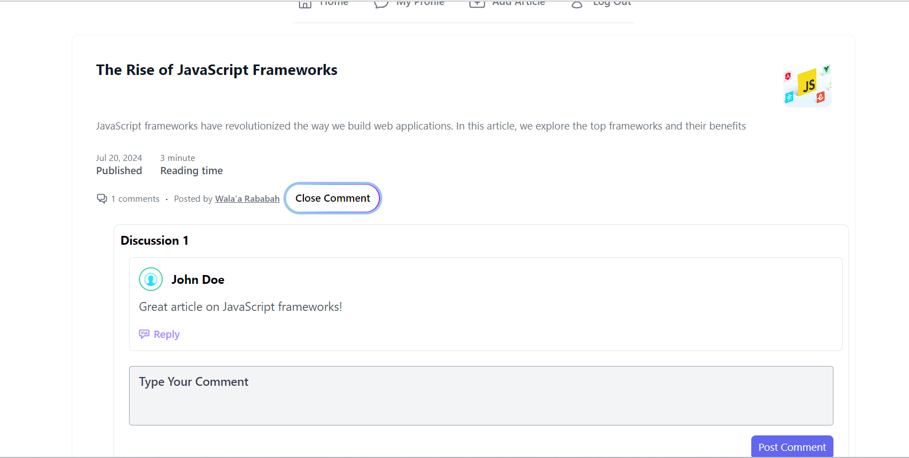
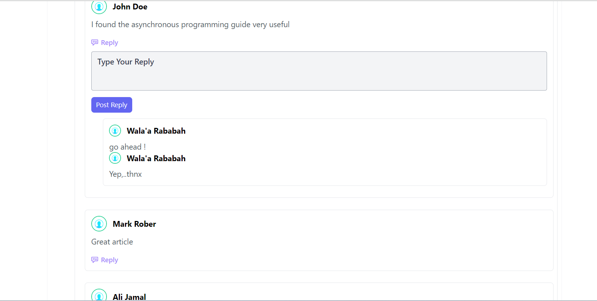

# Blog Application

This is a full-stack blog application built with Node.js, MongoDB, and Angular. The application allows users to create articles, add images, register, login, comment on articles, and reply to comments.

## 🚀 Key Features:
-  **Create Articles**: Users can create new articles with images.
-  **User Authentication**: Register and login functionality.
-  **Comment on Articles**: Users can comment on articles.
-  **Reply to Comments**: Users can reply to comments.

## 💻 Technologies Used:

-  **Frontend (Angular):** HTML, Tailwind, TypeScript
-  **Backend:** Node.js, Express
-  **Database:** MongoDB
-  **Authentication:** JSON Web Tokens (JWT)
-  **Other Tools:** Git, GitHub, Postman

## 🛠️ Installation and Usage:

- 🌀 Clone the repository: `git clone https://github.com/WalaaRababa/Blog`
- 📦 Install dependencies: `npm install`
- ▶️ Start the servers: `npm run dev`
 - ▶️ Start the frontend: `ng s`

## 📸 Screenshots
### 🌐 Register

*Register page for users to access the system.*
### 🌐 Login

*Login page for users to access the system.*

### 📊 Dashboard

  *Overview of the user dashboard.*

*User Profile for logged user.*

*Post a new article*

*Overview of the comment of article.*

*Overview of the  reply on comment of article.*
